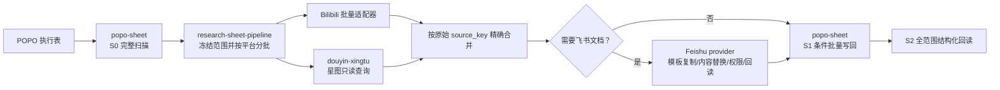

# MPC-WORK

面向达人与内容数据回收的 Codex Skill 套件。它把 POPO 在线执行表、Bilibili
公开接口的 API-first 适配器、抖音巨量星图、飞书文档和安全回写组合成一条可验证的流水线：

> 从 POPO 表完整读取任务范围 → 按平台批量查询 → 以原始键精确合并 →
> 可选生成/更新飞书文档 → 条件批量写回数据和文档链接 → 对全部产物重新读取并验证。

这不是三个互不相关的工具，而是一套由 `research-sheet-pipeline` 统一编排、
`popo-sheet` 负责表格读写、`douyin-xingtu` 负责星图取数的组合能力。Bilibili
适配器直接包含在主流水线中。

## 组成

| Skill | 职责 | 主要能力 |
|---|---|---|
| [`research-sheet-pipeline`](skills/research-sheet-pipeline/) | 总编排器 | 冻结任务范围、按平台分批、字段标准化、精确合并、快路径/复杂路径选择、最终核验 |
| [`popo-sheet`](skills/popo-sheet/) | POPO 表格适配器 | 结构化全表读取、普通值与链接批量写回、写前条件检查、完整回读，以及格式类 UI 操作 |
| [`douyin-xingtu`](skills/douyin-xingtu/) | 巨量星图只读适配器 | 达人/作品检索、已发布作品交叉校验、播放与互动数据、报价、榜单、内容和任务报告 |



## 完整工作流

一轮任务由 `research-sheet-pipeline` 负责调度。平台 skill 只处理自己拥有的能力，
不会在总编排器里临时重写 POPO 或星图私有协议。

### 第 0 步：把用户意图冻结成执行合同

开始前确定：

- POPO URL、输入 tab 和准确表头；
- 精确主键列，例如“达人昵称”；
- 哪些列决定 eligibility，例如“发布链接非空”“状态=已发布”；
- 平台列、Bilibili/抖音作品链接或达人 ID 列；
- 要获取的字段，例如播放、点赞、评论、分享、收藏、发布时间；
- 写入策略：刷新全部、只补空值、仅处理指定名称，或保留并合并旧链接；
- 输出目的地：原 POPO tab、其他 POPO tab、新表、飞书文档，或其中多个；
- 如果创建飞书文档：模板、命名规则、目标目录、权限规则和回填链接列。

三种常用写入语义：

| 用户说法 | 选择范围 | 已有值策略 |
|---|---|---|
| “刷新/更新为最新” | 所有 eligible 记录 | 覆盖指定字段 |
| “补空/填缺失” | eligible 且目标为空 | 保留非空字段 |
| “只处理这些达人” | 指定原始键 | 必须同时说明覆盖还是补空 |

用户没有明确写入语义时，流水线在 mutation 前停止确认，不自行猜测。

### 第 1 步：一次性 preflight 和能力路由

| 模块 | Preflight | 通过条件 |
|---|---|---|
| POPO | 启动一个 Kimi WebBridge task session，用原 URL `newTab:true` 打开新页 | 页面在线、可编辑、存在 `office.netease.com` iframe |
| Bilibili | `python skills/research-sheet-pipeline/scripts/bilibili_batch.py --self-test` | 依赖、HTTP client、输入解析和 bounded retry 自检通过 |
| 星图 | `python skills/douyin-xingtu/scripts/xingtu_batch.py self-test` | 已登录并真正进入 creator index，搜索控件已经渲染 |
| 飞书 | `python skills/research-sheet-pipeline/scripts/document_provider.py --format json` | 找到满足本任务 read/copy/update/permission/readback 能力的 provider |

路由是叠加关系：表里同时存在 Bilibili 和抖音记录时，两个适配器都必须运行；
识别到一个平台不能覆盖或取消另一个平台。

### 第 2 步：S0 从 POPO 完整读取并冻结范围

`popo-sheet` 从新开的任务页取得结构化 snapshot：

1. 按名称/ID 找到目标 tab 和 live headers；
2. 枚举 header 后的每一个 live data-row ID；
3. 确认 `scanned_data_rows = total_data_rows`；
4. 完整扫描结束后才执行 eligibility predicate；
5. 为每个命中项冻结：
   - 内部 `row_id`；
   - 表格中逐字保留的 `source_key`；
   - 平台、作品链接/ID、当前目标值；
   - 声明的目标字段与写入策略。

匹配结果可以分散在表格任意位置。固定上限、首屏、连续日期区块、截图、OCR
和视觉行号都不能定义任务范围。

### 第 3 步：按平台去重、分批并行取数

主流水线按 platform 分区，保留每条记录原始 `source_key`，只对 canonical item ID
做批内去重。

#### Bilibili API 批次

```powershell
python skills/research-sheet-pipeline/scripts/bilibili_batch.py --self-test
python skills/research-sheet-pipeline/scripts/bilibili_batch.py --input bilibili-items.json --output bilibili-results.json
python skills/research-sheet-pipeline/scripts/bilibili_batch.py --creator-input creators.json --recent 5 --output creator-results.json
python skills/research-sheet-pipeline/scripts/bilibili_batch.py --user-search "达人名称" --page 1 --page-size 20 --output candidates.json
```

- 视频输入接受 Bilibili URL、BV、AV 或带 `source_key` 的对象；
- 达人输入接受 MID 或 `space.bilibili.com/<mid>`；
- 纯数字字符串不会自动当作 MID，避免与 AID 混淆；
- 名称搜索只返回候选，不自动选择第一个结果；
- 默认并发为 2；遇到 `412` 只串行重试一次；
- 公开接口适配器无法解决的少量记录才进入浏览器 fallback；
- 已成功的 API 结果不会因后续 POPO 或飞书失败而重新抓取。

#### 巨量星图批次

```powershell
python skills/douyin-xingtu/scripts/xingtu_batch.py self-test
python skills/douyin-xingtu/scripts/xingtu_batch.py published-items --input published.json --output verified-results.json
python skills/douyin-xingtu/scripts/xingtu_batch.py items --input items.json --output item-results.json
python skills/douyin-xingtu/scripts/xingtu_batch.py authors --input authors.json --output author-results.json
python skills/douyin-xingtu/scripts/xingtu_batch.py ranking --output ranking.json
python skills/douyin-xingtu/scripts/xingtu_batch.py task-reports --output task-reports.json
```

- 已知作品和预期达人时优先用 `published-items`；
- 只有作品 URL/ID 时用 `items`；
- 只有达人名、抖音 ID 或星图 ID 时用 `authors`；
- 已知 item ID 在一个 batch 中查询，未解决的达人搜索因共享一个浏览器 tab 而串行执行；
- 用 `item_id → author_id/core_user_id → star_id → 精确显示名` 逐层确认身份；
- item 结果保留 endpoint 与 `observed_at`，明确记录播放量
  `stats.watch_cnt` 和发布时间 `create_time` 的来源；其他互动数值来自同一 item-detail
  `stats` 对象；
- `ambiguous`、`identity_conflict`、`metric_conflict`、`not_found`、
  `auth_required` 和 `page_not_ready` 不进入写计划。

`published-items` 默认以 item-detail `stats.watch_cnt` 作为当前播放量，把较旧的
creator-search 摘要保存在 `observations` / `warnings` 中。只有启用
`--strict-conflicts` 时，跨 surface 播放量差异才转为 `metric_conflict` 并阻断。

星图 adapter 的 `partial` 不等于自动可写：只有调用者明确允许，而且每个声明目标字段
实际上都存在时，pipeline 才能将其纳入当前字段计划；缺少任何声明目标都必须转为
`blocked`。

Bilibili 与星图是两个独立批次，可以并行。一个批次失败不会抹掉另一个批次已经验证的结果。

### 第 4 步：标准化、证据合并与 ready/blocked 判定

每条 canonical record 至少包含：

```json
{
  "source_key": "表格中的原始达人名",
  "join_key": "仅用于比较的标准化值",
  "source_ref": {
    "sheet": "执行表",
    "tab": "目标tab",
    "key_column": "达人昵称"
  },
  "fields": {},
  "evidence": [],
  "status": "ready",
  "errors": []
}
```

- `source_key` 贯穿读取、研究、文档和写回，全程不 trim、不覆盖、不 Unicode normalize；
- `join_key` 只用于发现候选，不能作为写回键；
- 同名达人必须通过作品/作者/星图 ID 等二级信号消歧；
- 每个声明目标字段都存在且非空时才是 `ready`；
- 缺字段、身份不确定或指标冲突的记录转为 `blocked`，保留错误和证据。

平台字段统一映射：

| 目标语义 | Bilibili | 星图 |
|---|---|---|
| 播放 | `play_count` | `metrics.play_count` |
| 点赞 | `like_count` | `metrics.like_count` |
| 评论 | `comment_count` | `metrics.comment_count` |
| 分享 | `share_count` | `metrics.share_count` |
| 收藏 | `favorite_count` | `metrics.favorite_count` |
| 发布时间 | `pubdate` | `metrics.publish_time` |

### 第 5 步：可选的飞书文档事务

只有用户要求创建/更新 BRF、报告或其他飞书交付物时才进入 document stage。
单纯刷新 POPO 指标不会加载飞书 provider、manifest 或 checkpoint。

文档流程：

1. 解析 provider，并要求本任务需要的精确 capability；
2. 对模板和目标做一次只读 resolve/read/permission preflight；
3. 每个模板只解析一次并缓存结构签名；
4. 复制模板或解析已有目标；
5. 根据 canonical record 生成一个合并 edit plan；
6. 对 grouped replacement 做一次 dry-run；
7. 每个文档只允许一个 writer，使用 idempotency key 应用一次；
8. 按已声明且 provider 支持的规则设置分享权限，或明确保持现状，并单独回读；
9. 回读标题、文本、block 结构、inline style、表格/图片锚点和权限；
10. 文档验证成功后，URL 才能进入 POPO 的链接写回计划。

多个独立文档可以 2–3 并发，但一个文档内部始终严格串行。

如果飞书 provider 或权限不可用，只停止 `document` stage；已经完成的 POPO 读取、
Bilibili/星图研究和 canonical records 全部保留，配置完成后从文档阶段继续。

### 第 6 步：S1 对 POPO 执行一次条件批量写回

写入前 `popo-sheet` 再取一个 fresh snapshot，并：

1. 重新扫描全部 live row IDs；
2. 双向比较 live eligible keys 与 frozen eligible keys；
3. 重新解析当前 sheet/row/column IDs、version 和旧值；
4. 快路径按声明的 live headers/target columns 解析字段；复杂 typed destination
   还必须核对 `field_map`；
5. 只为 `ready` 记录生成一个带 old-value precondition 的 batch；
6. 保留非目标字段、样式和相邻 hyperlink convention；
7. 由唯一 writer 提交一次。

如果 ACK 不明确，保持 writer lock，先读取实际状态；已落地值标记 verified，
只对未落地差值重新生成一次计划。任何 transport failure 后都丢弃旧 version 和内部 ID。

### 第 7 步：S2 验证 POPO、飞书和完整覆盖率

最终验证不只检查 write plan：

- 再次枚举 POPO 全部数据行并重新执行 frozen predicate；
- live eligible key set 必须与 frozen set 完全相等；
- 每个 ready key 的每个目标值/链接都必须精确回读；
- 每个 eligible key 必须归入 `ready`、策略允许的 `skipped` 或 `blocked`；
- 每个飞书文档必须重新验证内容、结构、权限和 URL；
- 只有 `verified_ready = ready` 且 `unexplained_mismatches = 0` 才能完成。

### 第 8 步：报告或恢复

最终摘要应包含：

- 表格总行数、实际扫描行数和 eligible 数；
- Bilibili/星图批次数、ready/blocked 数和未解决原始键；
- changed/unchanged/skipped 数；
- 写入行数、单元格数和飞书文档数；
- POPO 全范围回读与飞书结构/权限核验结果；
- 每个 blocked stage 的准确恢复动作。

简单任务的状态只保存在内存中。复杂/跨会话任务才把允许的最小信息写入
`checkpoint.json`、`change-plan.json` 和 `verification-summary.json`。

## 能做什么

### 一张表完成多平台数据刷新

- 从指定 POPO tab 枚举全部结构化数据行，再执行筛选条件。
- 支持非连续命中行，不依赖首个连续区块、可视区域或固定行数上限。
- 按平台拆成 Bilibili 与星图批次；互不依赖的批次可以并行运行。
- 将播放、点赞、评论、分享、收藏和发布时间映射到声明的目标列。
- 支持“全部刷新”“只补空值”和“仅处理指定名称”等明确写入策略。
- 一个平台或单条记录失败时保留 `blocked` 证据，不会静默丢行，也不会阻塞其他平台。

### Bilibili

主流水线内置 [`bilibili_batch.py`](skills/research-sheet-pipeline/scripts/bilibili_batch.py)：

- 视频 URL、BV、AV 批量取数；
- 创作者 MID、空间链接批量查询；
- 按名称搜索用户；
- 批内 canonical ID 去重；
- 返回播放、点赞、评论、分享、收藏及发布时间等标准字段。

### 抖音 / 巨量星图

[`douyin-xingtu`](skills/douyin-xingtu/) 复用用户已登录的 Kimi WebBridge 浏览器状态，
支持：

- 按作品 URL 或 `item_id` 查询；
- 按达人名、抖音 ID 或星图 ID 检索；
- 将作品 `author_id`、达人 `core_user_id`、`star_id` 与代表作品交叉校验；
- 回收播放及互动数据，并保留可用的 endpoint、字段来源、观测时间和冲突记录；
- 查询达人报价、预期 CPM、榜单及星图任务报告；
- 明确区分 `page_not_ready`、`auth_required`、`ambiguous`、
  `identity_conflict` 与 `metric_conflict`。

完整返回结构见
[`references/output-contract.md`](skills/douyin-xingtu/references/output-contract.md)。

### POPO 表格

[`popo-sheet`](skills/popo-sheet/) 提供两条互斥执行通道：

| 通道 | 适用任务 |
|---|---|
| 结构化快路径 | 读取或替换普通值、超链接；一次条件批量写入；结构化完整回读 |
| UI 路径 | 公式、行列尺寸、边框、换行、合并、布局、格式和未知 schema |

普通值和链接任务优先使用
[`structured-fast-lane.md`](skills/popo-sheet/references/structured-fast-lane.md)，
结构化验证成功后不再执行截图、逐格点击或剪贴板探测。

[`name_match_tsv.py`](skills/popo-sheet/scripts/name_match_tsv.py) 只用于有界的矩形剪贴板
fallback；它不是 POPO writer，也不能用相对行号或局部 TSV 证明全表覆盖率。

### 飞书文档

主流水线包含一个不携带凭据的飞书适配器
[`feishu_doc.py`](skills/research-sheet-pipeline/scripts/feishu_doc.py)，并通过
[`document_provider.py`](skills/research-sheet-pipeline/scripts/document_provider.py)
选择当前机器可用的 provider。

支持的文档动作包括：

- 解析 Wiki/Docx URL 或 token；
- 读取原始文本、全部 blocks 和结构签名；
- 在原知识空间或 Drive 根目录复制模板；
- grouped text replacement（支持 dry-run）和 append；
- 读取公开权限；
- 在明确确认目标 file token 后设置 anyone-with-link editable；
- 写后重新读取内容、inline-style-aware 结构签名和权限。

Provider 解析顺序：

1. 命令行显式指定的 provider/command；
2. 显式 local config；
3. `FEISHU_DOC_CLI`；
4. 用户目录下的 pipeline local config；
5. `PATH` 中兼容的 CLI；
6. bundled `feishu_doc.py`。

Resolver 本身无法检查 Agent connector catalog。如果结果是 `needs_credentials` 或
`unavailable`，由 Agent 在 resolver 之外检查能力等价的 authenticated connector。
外部兼容 CLI 一律先视为 `legacy_unverified`，完成只读 capability 和准确资源 preflight
后才能参与 mutation。

运行前检查：

```powershell
python skills/research-sheet-pipeline/scripts/document_provider.py `
  --required-capability document.read `
  --required-capability document.copy `
  --required-capability document.update `
  --required-capability document.readback `
  --required-capability document.structure.read `
  --required-capability permission.public.read `
  --format json
python skills/research-sheet-pipeline/scripts/feishu_doc.py doctor
python skills/research-sheet-pipeline/scripts/feishu_doc.py self-test
```

如果任务明确要求将公开权限改为 anyone-with-link editable，还必须额外重复传入
`--required-capability permission.public.anyone_editable`，并在 mutation 时确认准确的
目标 file token。

Bundled provider 使用 tenant-app identity。运行时可从进程环境、`FEISHU_ENV_FILE`、
`$CODEX_HOME/secrets/research-sheet-pipeline/feishu.env` 或
`~/.config/research-sheet-pipeline/feishu.env` 读取本地配置的
`FEISHU_APP_ID` / `FEISHU_APP_SECRET`。凭据文件不能提交，secret 不能粘贴到聊天、
manifest、checkpoint 或日志中。

飞书 App 还必须具备任务实际需要的 Wiki、Docx、Drive 和 permission scopes，
并能访问准确的模板与目标位置。`doctor --auth` 只证明 token 可签发；mutation 前仍要对
具体资源做一次只读 resolve/read/permission preflight。需要用户个人授权范围时，应改用
authenticated connector，不能冒用 tenant credentials。

## 数据完整性保证

### 1. 必须先完整扫描，再筛选

每轮读取都要求：

```text
scanned_row_ids = live_data_row_ids
scanned_data_rows = total_data_rows
filter_after_full_scan = true
```

禁止使用 `slice`、固定上限、viewport 样本、early break、首个匹配区块或截图 OCR
确定可写范围。尾部行和非连续行与首屏行具有相同处理优先级。

部分扫描最危险的地方不是“报错”，而是产生错误的自证闭环：例如实际有 13 条 eligible
记录，只冻结前 10 条，再用同一份 10 条 write plan 做回读，就会得到看似正确的
`10/10`，但剩余 3 条从未进入分母。现在 S0、S1、S2 都独立全扫，写后分母来自 live
eligible scope，因此局部 `mismatches=0` 不能被报告为完成。

### 2. POPO 写入必须新开任务页

每次 mutation 都必须通过 Kimi WebBridge 使用当前用户提供的 URL 和 `newTab:true`
打开一个新页面。禁止借用或刷新显示“只读”“已离线”或重连中的旧页面。

如果任务页在写入或回读前掉线，只允许再打开一个 fresh replacement；replacement
仍失败时停止表格阶段，不创建无限替换链。

### 3. 原始键贯穿全流程

表格中的 `source_key` 按字节保留。标准化名称只用于比较，不能作为写回键。
作品身份优先使用 `item_id → author_id/core_user_id → star_id → 精确显示名`，
有歧义或身份冲突时停止该记录。

### 4. 字段不完整时禁止错位写入

每条记录的全部声明目标都必须非空。五字段刷新不会把只有四个字段的 `partial`
结果写进表格，也不会在列之间移动或猜测数值；缺字段记录会转为 `blocked`。

### 5. 单写者、写前条件和完整回读

- 写前重新取得最新 snapshot、version、内部行列 ID 和旧值；
- 冻结范围与实时范围必须双向完全一致；
- 所有 ready 记录由一个 writer 一次条件批量提交；
- ACK 不明确时先读取实际状态，再对未落地差值重试一次；
- 完成分母来自写后的实时完整扫描，不来自 write plan 长度；
- 只有全部 ready 键和全部请求字段回读一致，任务才算完成。

## 快路径与复杂路径

| 模式 | 什么时候使用 | 运行开销 |
|---|---|---|
| Fixed sheet fast path | 一个输入 tab、一个表格目的地、确定的筛选/字段/写入策略；无文档、新表、跨会话或未知 mutation outcome | 只加载编排器和实际命中的 companion skill；不创建 manifest、checkpoint、截图或 debug payload |
| In-memory BRF fast path | 1–5 个 entity、一个 sheet/tab、单模板族、无表格写回 | 合同保存在内存；模板结构只读一次；各文档独立验证，不创建 manifest/checkpoint |
| Complex path | 多输入/多目的地、创建新表、文档与表格混合副作用、动态路由、超过 5 份文档、跨会话恢复或 mutation 结果未知 | 使用 schema `3.0` manifest、原子 checkpoint 和对应的最小引用 |

平台数量、adapter 数量或达人数量本身不构成复杂任务。普通表格刷新走 fixed sheet
fast path，小规模无回写 BRF 走 in-memory BRF fast path；文档本身不会自动触发 complex。
复杂能力不会被无条件加载到简单任务中。

## 快速开始

### 1. 安装三个 skill

本仓库提供的是三个 Codex skill，不是 `.codex-plugin` 插件。可以让 Codex 的
`skill-installer` 从 `vkai4323-byte/MPC-WORK` 下的三个 `skills/*` 路径安装，
也可以在目标目录尚不存在时手工复制：

```bash
git clone https://github.com/vkai4323-byte/MPC-WORK.git
cd MPC-WORK
mkdir -p ~/.codex/skills
cp -R skills/research-sheet-pipeline ~/.codex/skills/
cp -R skills/douyin-xingtu ~/.codex/skills/
cp -R skills/popo-sheet ~/.codex/skills/
```

Windows PowerShell：

```powershell
git clone https://github.com/vkai4323-byte/MPC-WORK.git
Set-Location MPC-WORK
$skillRoot = Join-Path $env:USERPROFILE ".codex\skills"
New-Item -ItemType Directory -Force -Path $skillRoot | Out-Null
Copy-Item -Recurse -Force .\skills\research-sheet-pipeline $skillRoot
Copy-Item -Recurse -Force .\skills\douyin-xingtu $skillRoot
Copy-Item -Recurse -Force .\skills\popo-sheet $skillRoot
```

手工复制示例适用于 fresh install。升级已有版本时，优先用 `skill-installer`，或在确认
准确目标后完整替换对应 skill 目录，避免合并复制遗留已删除的旧文件。安装或更新后，
在下一轮任务中让 Codex 重新发现 skill。

### 2. 准备运行环境

- Python 3.10+；
- 独立安装并运行的 Kimi WebBridge；
- 浏览器中已经登录 POPO；使用星图功能时还需登录巨量星图；
- Bilibili 适配器依赖：

```bash
python -m pip install -r skills/research-sheet-pipeline/requirements.txt
```

Cookie、token、请求头和账号凭据不应写入仓库、输入 JSON、manifest 或 checkpoint。

#### Kimi WebBridge

Kimi WebBridge 是外部前置能力，不包含在本仓库的三个 skill 中。本仓库面向已经允许
安装浏览器扩展和本地 daemon 的环境；安装与更新入口：

- [Kimi WebBridge 中文说明](https://www.kimi.com/zh-cn/features/webbridge)
- [Kimi WebBridge English guide](https://www.kimi.com/features/webbridge)

启动 daemon：

macOS / Linux：

```bash
~/.kimi-webbridge/bin/kimi-webbridge start
```

Windows PowerShell：

```powershell
& "$env:USERPROFILE\.kimi-webbridge\bin\kimi-webbridge.exe" start
```

检查 daemon、extension 和 skill 版本是否就绪：

macOS / Linux：

```bash
~/.kimi-webbridge/bin/kimi-webbridge status
```

Windows PowerShell：

```powershell
& "$env:USERPROFILE\.kimi-webbridge\bin\kimi-webbridge.exe" status
```

确认输出中的 daemon 正在运行、extension 已连接，并处理任何 version/skill mismatch。
`status` 不读取或保存当前标签 URL。该检查只证明 WebBridge 基础连接；星图还必须运行
`xingtu_batch.py self-test` 验证 creator index 与登录态；POPO 则在真实任务中通过
新开的页面、office iframe、在线/可编辑状态和结构化 snapshot gate 验证。

[`webbridge_command.ps1`](skills/popo-sheet/scripts/webbridge_command.ps1) 只用于 Windows
上的实际 WebBridge 请求，依赖 PowerShell 与 `curl.exe`，没有声明为跨平台 helper。

如果任务包含飞书文档，再准备一种可用方式：

- 在本机安全配置 `FEISHU_APP_ID` / `FEISHU_APP_SECRET` 并授权所需 scopes；或
- 使用当前 Agent 已认证且能力等价的飞书 connector；或
- 在用户 local config 中指定已经配置好的兼容 CLI。

详细配置与 provider gate 见
[`document-providers.md`](skills/research-sheet-pipeline/references/document-providers.md)。

### 3. 直接描述任务

完整多平台刷新示例：

```text
用 research-sheet-pipeline 处理这个 POPO 表。
新开 POPO 网页，遍历全部数据行后筛选“发布链接非空”的记录；
按平台批量查询 Bilibili 和星图的播放、点赞、评论、分享、收藏，
按表格原始达人名精确写回，并对全部命中行完整回读验证。
```

星图只读查询示例：

```text
用 douyin-xingtu 批量核对这些已发布抖音链接的达人身份和当前播放/互动数据，
返回证据和冲突，不写表。
```

POPO → Bilibili/星图 → 飞书 BRF → POPO 链接回填示例：

```text
用 research-sheet-pipeline 读取这个 POPO 执行表。
新开 POPO 网页并完整扫描所有行，只处理状态为“已发布”的达人；
按平台用 Bilibili API-first adapter 和 douyin-xingtu 批量取得当前数据。
使用指定飞书模板为每个 ready 达人生成一份外部 BRF，保留模板格式，
不改变分享权限并回读报告当前权限；文档内容和权限回读通过后，
把指标和 BRF 链接一次性写回 POPO。
指标列覆盖更新，已有 BRF 链接保留并追加新链接；最后核验全部 eligible 行和全部文档。
```

POPO 格式任务示例：

```text
用 popo-sheet 新开这个 POPO 链接，把指定列设置为自动换行并沿用相邻列边框，
完成后回读值并提供必要的格式截图。
```

### 4. 复杂任务 manifest 与恢复

以下情况才使用 schema `3.0` manifest：

- 多个输入 tab 或多个 destination；
- 同时包含文档与表格 mutation；
- 动态 template/destination routing；
- 创建新表；
- 超过 5 份文档；
- 跨会话恢复；
- POPO 或飞书 mutation outcome 未知。

从模板开始：

```powershell
Copy-Item skills/research-sheet-pipeline/assets/job-template.json .\job.json
```

先编辑 `job.json` 并声明：

- `scope`：selection、eligibility source 和 exact-key policy；
- `sheet.tabs[]`：每个输入 tab 的 key、eligibility/source/target columns；
- `research.sources` / `research.fields`：Bilibili、星图和需要的字段；
- `templates{}`、`destinations[]`、`routing_rules[]`：飞书模板与输出路由；
- `documents`：create/update、权限、audience 和 `deliverable_only`；
- `writeback`：fill/append/upsert、覆盖/保留/合并及字段级策略；
- `verification`：全范围 readback；
- `execution`：artifact 目录、超时、retry budget 和 checkpoint。

所有必填项和实际 URL/字段补齐后再验证：

```powershell
python skills/research-sheet-pipeline/scripts/compose_chain.py .\job.json --format json
```

复杂任务的标准 chain：

```text
sheet_context
→ web_research
→ normalize
→ document（可选）
→ sheet_create（可选）
→ sheet_writeback
→ verify
```

每个 verified stage 后以及 blocked/unknown 返回前，使用 helper 原子更新固定文件名
`checkpoint.json`。恢复时先验证 schema、contract/checkpoint hash、source snapshot、
frozen keys、records、writer lock 和 readback proofs，只从第一个未验证阶段继续。
已经验证的研究、文档或表格值不会重跑。

## 本地验证

```bash
python skills/douyin-xingtu/scripts/test_xingtu_batch.py
python skills/research-sheet-pipeline/scripts/bilibili_batch.py --self-test
python skills/research-sheet-pipeline/scripts/compose_chain.py --self-test
python skills/research-sheet-pipeline/scripts/checkpoint_artifacts.py --self-test
python skills/research-sheet-pipeline/scripts/document_provider.py --self-test
python skills/research-sheet-pipeline/scripts/feishu_doc.py self-test
```

离线自动化命令实际覆盖：

- 星图 readiness、认证、身份和失败分类；
- Bilibili 依赖/client、ID 输入解析、normalize fixture 和 bounded retry；
- 多模块 compose 合约；
- checkpoint 原子写入、完整性校验、敏感信息清洗和最小产物 allowlist；
- 飞书 provider 解析、文档操作参数和离线安全检查。

`xingtu_batch.py self-test` 是需要 Kimi WebBridge daemon 和有效登录态的 live readiness
检查；`test_xingtu_batch.py` 是离线单元测试。Bilibili `--self-test` 不执行真实公共接口
批处理，也不证明某次线上结果。

POPO 全范围扫描、fresh-tab mutation、一次 replacement 和完整回读由 skill contract
与 prompt regression 约束；最终正确性依赖真实页面中的 S0/S1/S2 live structural gate，
没有伪造的离线 writer 测试。

这些测试覆盖适配器、合约和已知失败模式，不等同于对任意账号、权限、模板和工作簿的
全组合 production 认证。真实 mutation 仍必须通过当前目标的 live preflight 和 readback。

## 安全边界

- 星图能力是只读查询，不执行下单、发布任务、达人清单修改、财务、结算、充值、
  消息发送或人群推送。
- POPO 页面出现只读、离线、保护提示或未知写入结果时 fail closed。
- 不以截图、ACK 或局部 `mismatches=0` 作为完成证明。
- 不持久化 cookie、token、完整工作簿快照或非必要调试文件。
- 飞书文档适配器不包含凭据；App credentials 始终留在用户本地环境。

## 目录

```text
skills/
├── research-sheet-pipeline/   # 总编排、Bilibili、文档与 checkpoint
├── douyin-xingtu/             # 星图只读批量客户端与输出合约
└── popo-sheet/                # POPO 结构化快路径与 UI fallback
```
